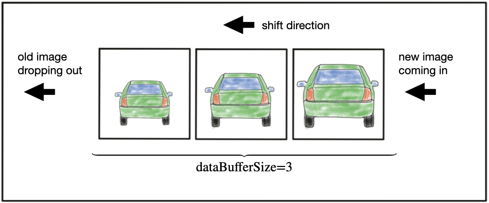
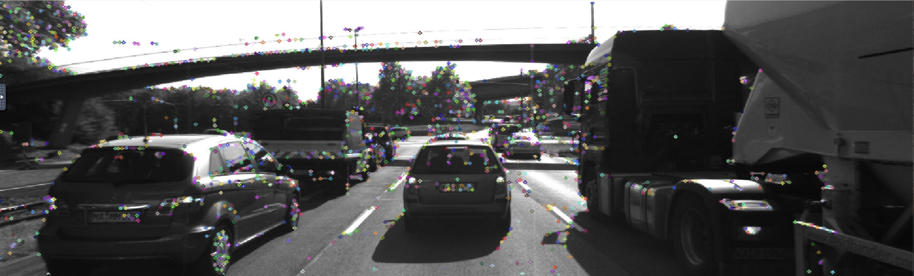
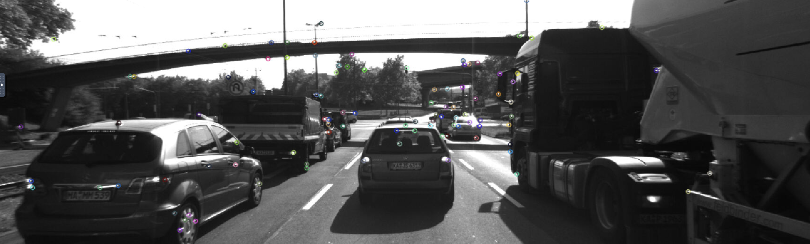
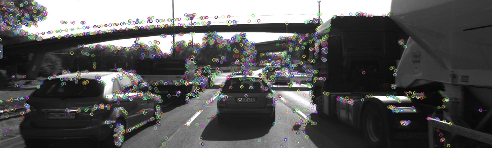
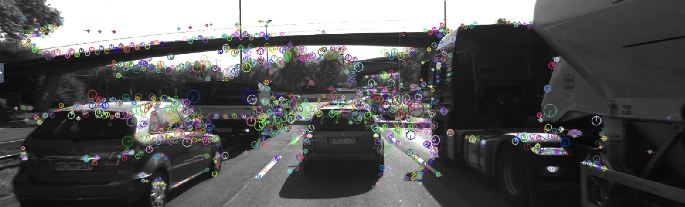
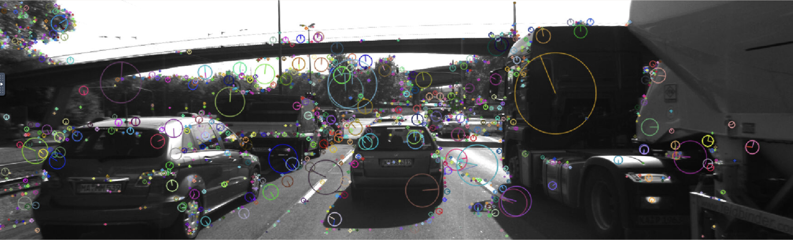

# SFND 2D Feature Tracking


The idea of the camera course is to build a collision detection system - that's the overall goal for the Final Project. As a preparation for this, you will now build the feature tracking part and test various detector / descriptor combinations to see which ones perform best. This mid-term project consists of four parts:

* First, you will focus on loading images, setting up data structures and putting everything into a ring buffer to optimize memory load. 
* Then, you will integrate several keypoint detectors such as HARRIS, FAST, BRISK and SIFT and compare them with regard to number of keypoints and speed. 
* In the next part, you will then focus on descriptor extraction and matching using brute force and also the FLANN approach we discussed in the previous lesson. 
* In the last part, once the code framework is complete, you will test the various algorithms in different combinations and compare them with regard to some performance measures. 

See the classroom instruction and code comments for more details on each of these parts. Once you are finished with this project, the keypoint matching part will be set up and you can proceed to the next lesson, where the focus is on integrating Lidar points and on object detection using deep-learning.   

### MP.1 The Data Buffer  
To prevent push all images into a vector inside a for-loop and with every new image, the data structure grows as we process a large image sequence with several thousand images and Lidar point clouds over night this would push the memory of our computer to its limit and eventually slow down the entire program, we apply the concept of ring buffer to hold a certain number of images in memory so that when a new one arrives, the oldest one is deleted from one end of the vector and the new one is added to the other end.  
  


```
// push image into data frame buffer
DataFrame frame;
frame.cameraImg = imgGray;
dataBuffer.push_back(frame);

// Only hold certain number of images in memory prevent push the memory of the computer to its limit and eventually slow down the entire program.
if (dataBuffer.size() > dataBufferSize)
{
  dataBuffer.erase(dataBuffer.begin());
}
```  
### MP.2 Keypoint Detection  
We modified `string detectorType` for use different type of detectors as the following:   
ShiTomasi  
  
Harris  
  
FAST  
  
BRISK  
  
ORB    
  
AKAZE  
   
SIFT  
   

### MP.3 Keypoint Removal  
We remove all keypoints outside of a pre-defined rectangle and only use the keypoints within the rectangle for further processing at line [102](https://github.com/polarbeargo/SFND_2D_Feature_Tracking/blob/10352ddc3650d88da39eb5e7dac39fb9125adbb9/src/MidTermProject_Camera_Student.cpp#L102) - [118](https://github.com/polarbeargo/SFND_2D_Feature_Tracking/blob/10352ddc3650d88da39eb5e7dac39fb9125adbb9/src/MidTermProject_Camera_Student.cpp#L118).  

### MP.4 Keypoint Descriptors  
We implemented descriptors BRIEF, ORB, FREAK, AKAZE and SIFT and make them selectable by setting a string accordingly at line [143](https://github.com/polarbeargo/SFND_2D_Feature_Tracking/blob/10352ddc3650d88da39eb5e7dac39fb9125adbb9/src/MidTermProject_Camera_Student.cpp#L143) - [149](https://github.com/polarbeargo/SFND_2D_Feature_Tracking/blob/10352ddc3650d88da39eb5e7dac39fb9125adbb9/src/MidTermProject_Camera_Student.cpp#L149).
### MP.5-6 Matching Descriptors & Descriptor Distance Ratio  
We implemented FLANN matching as well as k-nearest neighbor selection. Both methods can be selectable using the respective strings in the main function at MidTermProject_Camera_Student.cpp line [159](https://github.com/polarbeargo/SFND_2D_Feature_Tracking/blob/10352ddc3650d88da39eb5e7dac39fb9125adbb9/src/MidTermProject_Camera_Student.cpp#L159) - [174](https://github.com/polarbeargo/SFND_2D_Feature_Tracking/blob/10352ddc3650d88da39eb5e7dac39fb9125adbb9/src/MidTermProject_Camera_Student.cpp#L174) and matching2D_Student.cpp line [44](https://github.com/polarbeargo/SFND_2D_Feature_Tracking/blob/10352ddc3650d88da39eb5e7dac39fb9125adbb9/src/matching2D_Student.cpp#L44) - [64](https://github.com/polarbeargo/SFND_2D_Feature_Tracking/blob/10352ddc3650d88da39eb5e7dac39fb9125adbb9/src/matching2D_Student.cpp#L64).  
  
  

### MP.7 Performance Evaluation 1  
Count the number of keypoints on the preceding vehicle for all 10 images and take note of the distribution of their neighborhood size. Do this for all the detectors you have implemented.  

Detector Type  |  Img. No. 1 |  Img. No. 2 |  Img. No. 3 |  Img. No. 4 |  Img. No. 5 |  Img. No. 6 |  Img. No. 7 |  Img. No. 8 |  Img. No. 9 |  Img. No. 10
-------------  | :---------: | :---------: | :---------: | :---------: | :---------: | :---------: | :---------: | :---------: | :---------: | :---------:
SHITOMASI      | 1370        | 1301        | 1361        | 1358        | 1333        | 1284        | 1322        | 1366        | 1389        | 1339
HARRIS         | 115         | 98          | 113         | 121         | 160         | 383         | 85          | 210         | 171         | 281
FAST           | 1824        | 1832        | 1810        | 1817        | 1793        | 1796        | 1788        | 1695        | 1749        | 1770
BRISK          | 2757        | 2777        | 2741        | 2735        | 2757        | 2695        | 2715        | 2628        | 2639        | 2672
ORB            | 500         | 500         | 500         | 500         | 500         | 500         | 500         | 500         | 500         | 500
AKAZE          | 1351        | 1327        | 1311        | 1351        | 1360        | 1347        | 1363        | 1331        | 1357        | 1331
SIFT           | 1438        | 1371        | 1380        | 1335        | 1305        | 1370        | 1396        | 1382        | 1463        | 1422

### MP.8 Performance Evaluation 2  
Count the number of matched keypoints for all 10 images using all possible combinations of detectors and descriptors. In the matching step, use the BF approach with the descriptor distance ratio set to 0.8.  

| Average Matches for Detector / Descriptor Pair | BRISK | BRIEF | ORB | FREAK | AKAZE | SIFT |
|----------------------------------------------------|-------|-------|-----|-------|-------|------|
| HARRIS                                             | 21.4  | 28    | 21  | 28    | N/A   | 21   |
| SHI-TOMASI                                         | 118   | 104   | 107 | 118   | N/A   | 107  |
| FAST                                               | 146   | 149   | 135 | 148   | N/A   | 135  |
| ORB                                                | 98    | 115   | 103 | 55    | N/A   | 103  |
| BRISK                                              | 270   | 189   | 251 | 233   | N/A   | 251  |
| AKAZE                                              | 165   | 160   | 149 | 149   | 139   | 149  |
| SIFT                                               | 137   | 125   | N/A | 124   | N/A   | 125  |  
  
### MP.9 Performance Evaluation 3  
Log the time it takes for keypoint detection and descriptor extraction.  

| Combination(detect + descriptor)| Detection Time | Extraction Time | 
| ---                             | ---            | ---             |   
| Shi-Tomasi + BRISK              |    15.65ms     |   1.21ms        | 
| Shi-Tomasi + BRIEF              |    15.65ms     |   1.35ms        |  
| Shi-Tomasi + ORB                |    15.65ms     |   1.34ms        |  
| Shi-Tomasi + FREAK              |    15.65ms     |  44.47ms        |   
| Shi-Tomasi + AKAZE              |    N/A         |      N/A        |     
| Shi-Tomasi + SIFT               |    15.65ms     |     26ms        |  
| Harris + BRISK                  |    14.82ms     |   1.35ms        |  
| Harris + BRIEF                  |    14.82ms     |   0.87ms        | 
| Harris + ORB                    |    14.82ms     |   1.25ms        |  
| Harris + FREAK                  |    14.82ms     |  44.38ms        |  
| Harris + AKAZE                  |    N/A         |       N/A       |  
| Harris + SIFT                   |    14.82ms     |  18.81ms        |     
| FAST + BRISK                    |    0.98ms      |   1.65ms        |   
| FAST + BRIEF                    |    0.98ms      |   1.20ms        | 
| FAST + ORB                      |    0.98ms      |   1.72ms        |   
| FAST + FREAK                    |    0.98ms      |  50.92ms        |  
| FAST + AKAZE                    |    N/A         |     N/A         |   
| FAST + SIFT                     |    0.98ms      |     34ms        |     
| BRISK + BRISK                   |      43ms      |   3.38ms        |   
| BRISK + BRIEF                   |      43ms      |   3.12ms        |  
| BRISK + ORB                     |      43ms      |   9.12ms        |    
| BRISK + FREAK                   |      43ms      |  53.12ms        |   
| BRISK + AKAZE                   |      N/A       |      N/A        |    
| BRISK + SIFT                    |      43ms      |     51ms        |   
| ORB + BRIEF                     |    7.92ms      |   0.95ms        |        
| ORB + BRISK                     |    7.92ms      |   1.45ms        |    
| ORB + ORB                       |    7.92ms      |  11.25ms        |     
| ORB + FREAK                     |    7.92ms      |  50.10ms        |    
| ORB + AKAZE                     |       N/A      |      N/A        |    
| ORB + SIFT                      |       N/A      |      N/A        | 
| AKAZE + BRIEF                   |  100.27ms      |   1.51ms        |    
| AKAZE + BRISK                   |  100.27ms      |   2.35ms        |     
| AKAZE + ORB                     |  100.27ms      |   4.11ms        |    
| AKAZE + FREAK                   |  100.27ms      |  48.51ms        |    
| AKAZE + AKAZE                   |  100.27ms      |  93.12ms        |    
| AKAZE + SIFT                    |  100.27ms      |     38ms        |     
| SIFT + BRIEF                    |  160.95ms      |   1.12ms        |      
| SIFT + BRISK                    |  160.95ms      |   1.81ms        |   
| SIFT + FREAK                    |  160.95ms      |  52.51ms        |    
| SIFT + AKAZE                    |       N/A      |      N/A        |   
| SIFT + SIFT                     |  160.95ms      |    102ms        |   

### Conclusion  
From above performance evaluation, the top 3 detector/descriptor combinations are the followings:
- FAST-BRIEF  
- FAST-BRISK  
- FAST-ORB   


## Dependencies for Running Locally
1. cmake >= 2.8
 * All OSes: [click here for installation instructions](https://cmake.org/install/)

2. make >= 4.1 (Linux, Mac), 3.81 (Windows)
 * Linux: make is installed by default on most Linux distros
 * Mac: [install Xcode command line tools to get make](https://developer.apple.com/xcode/features/)
 * Windows: [Click here for installation instructions](http://gnuwin32.sourceforge.net/packages/make.htm)

3. OpenCV >= 4.1
 * All OSes: refer to the [official instructions](https://docs.opencv.org/master/df/d65/tutorial_table_of_content_introduction.html)
 * This must be compiled from source using the `-D OPENCV_ENABLE_NONFREE=ON` cmake flag for testing the SIFT and SURF detectors. If using [homebrew](https://brew.sh/): `$> brew install --build-from-source opencv` will install required dependencies and compile opencv with the `opencv_contrib` module by default (no need to set `-DOPENCV_ENABLE_NONFREE=ON` manually). 
 * The OpenCV 4.1.0 source code can be found [here](https://github.com/opencv/opencv/tree/4.1.0)

4. gcc/g++ >= 5.4
  * Linux: gcc / g++ is installed by default on most Linux distros
  * Mac: same deal as make - [install Xcode command line tools](https://developer.apple.com/xcode/features/)
  * Windows: recommend using either [MinGW-w64](http://mingw-w64.org/doku.php/start) or [Microsoft's VCPKG, a C++ package manager](https://docs.microsoft.com/en-us/cpp/build/install-vcpkg?view=msvc-160&tabs=windows). VCPKG maintains its own binary distributions of OpenCV and many other packages. To see what packages are available, type `vcpkg search` at the command prompt. For example, once you've _VCPKG_ installed, you can install _OpenCV 4.1_ with the command:
```bash
c:\vcpkg> vcpkg install opencv4[nonfree,contrib]:x64-windows
```
Then, add *C:\vcpkg\installed\x64-windows\bin* and *C:\vcpkg\installed\x64-windows\debug\bin* to your user's _PATH_ variable. Also, set the _CMake Toolchain File_ to *c:\vcpkg\scripts\buildsystems\vcpkg.cmake*.


## Basic Build Instructions

1. Clone this repo.
2. Make a build directory in the top level directory: `mkdir build && cd build`
3. Compile: `cmake .. && make`
4. Run it: `./2D_feature_tracking`.
